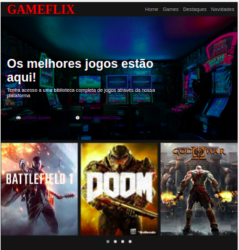
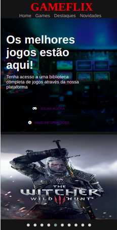

# DIO - Interface Streaming

Projeto desenvolvido no bootcamp HTML Web Developer oferecido pela [Digital Innovation One](https://digitalinnovation.one/).

## Objetivo do projeto

Recriar a interface do principal site de streaming mundial utilizando tecnologias simples como HTML5, CSS3 e JavaScript.

- Estruturar um layout de streaming
- Criar um carousel de imagens
- Utilizar técnicas de CSS3 com Flexbox e media query
- Utilizar plugins JQuery

## Resultado

Para esse desafio criei a Gameflix, um streaming de jogos.

